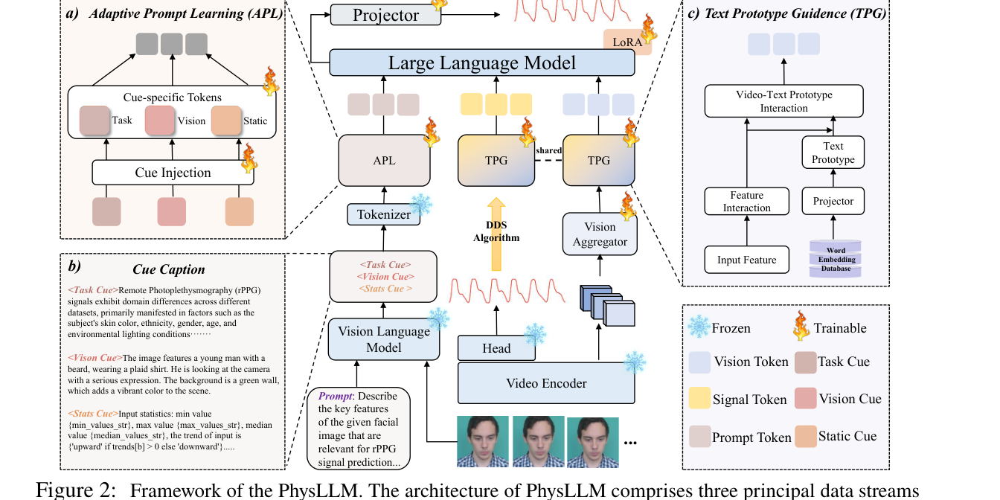

# PhysLLM

PhysLLM is a multimodal remote physiological sensing pipeline that combines a physiological video encoder, a face attribute encoder, optional scene context, and an LLM backbone to predict an rPPG waveform from a facial video clip.

This repository is the cleaned public release of the PhysLLM code path and its minimal training / inference pipeline.

## Paper

PhysLLM has been accepted to **ICLR 2026**.

- Title: *PhysLLM: Harnessing Large Language Models for Cross-Modal Remote Physiological Sensing*
- Paper: [arXiv:2505.03621](https://arxiv.org/abs/2505.03621)



*Figure 2 from the ICLR 2026 paper: overall architecture of PhysLLM.*

## Release Scope

Included in this repository:

- PhysLLM and NewPhysLLM model code
- core loaders for `UBFC-rPPG`, `PURE`, `BUAA`, and `MMPD`
- evaluation code and example configs
- the multi-source training entry point used for cross-dataset experiments

Not included in this repository:

- raw datasets or preprocessed caches
- experiment outputs, logs, plots, and saved predictions
- local environment folders
- private or third-party checkpoints

## Model Overview

The public code path currently supports:

- video encoders: `PhysNet`, `PhysFormer`, `EfficientPhys`, `clip`
- face encoder: `FaceXFormer`
- environment encoder: `clip` or a fixed description prompt
- LLM backbones: `BERT`, `GPT2`, `LLAMA`

## Repository Layout

```text
configs/                 example train / test configs
dataset/                 dataset loaders and shared preprocessing helpers
evaluation/              waveform and HR metric computation
neural_methods/model/    PhysLLM, encoders, and supporting modules
neural_methods/trainer/  training and inference entry points
main.py                  top-level CLI entry point
config.py                configuration schema
```

## Installation

```bash
python -m venv .venv
source .venv/bin/activate
pip install -r requirements.txt
```

If you prefer conda:

```bash
conda env create -f environment.yaml
conda activate physllm
```

## Data Configuration

The example configs use placeholder paths. Before running, edit:

- `TRAIN.DATA.MULTI_SOURCE.SOURCE_PATHS`
- `TRAIN.DATA.CACHED_PATH`
- `VALID.DATA.DATA_PATH`
- `TEST.DATA.DATA_PATH`
- `TEST.DATA.CACHED_PATH`

The multi-source example is set up for:

- source domains: `UBFC-rPPG`, `PURE`, `BUAA`, `MMPD`
- held-out evaluation domain: `ZPU / ZPH`
- clip length: `160`
- spatial resolution: `72 x 72`

## Checkpoint Preparation

This release expects external checkpoints to be provided through config fields or environment variables.

| Purpose | Config field | Environment variable | Notes |
| --- | --- | --- | --- |
| Physiological video encoder | `MODEL.CHECKPOINTS.VIDEO_ENCODER` | `PHYSLLM_VIDEO_ENCODER_CKPT` | Must match `MODEL.VIDEO_ENC` |
| Face attribute encoder | `MODEL.CHECKPOINTS.FACE_ENCODER` | `PHYSLLM_FACE_ENCODER_CKPT` | Expected by `FaceXFormerEncoder` |
| Trained PhysLLM model for test-only inference | `INFERENCE.MODEL_PATH` | - | Used in `TOOLBOX_MODE: only_test` |

Typical setup:

```bash
export PHYSLLM_VIDEO_ENCODER_CKPT=/path/to/video_encoder_checkpoint.pth
export PHYSLLM_FACE_ENCODER_CKPT=/path/to/facexformer_checkpoint.pt
```

Notes:

- if `MODEL.VIDEO_ENC: PhysNet`, the video encoder checkpoint must be a PhysNet checkpoint
- if `MODEL.VIDEO_ENC: PhysFormer`, it must be a PhysFormer checkpoint
- if `MODEL.VIDEO_ENC: EfficientPhys`, it must be an EfficientPhys checkpoint
- Hugging Face LLM weights and CLIP assets are resolved at runtime; pre-download them if your cluster is offline

## Training

The default public training example is:

- config: `configs/physllm_multisource_train_example.yaml`
- mode: `multi_train_and_test`

Run:

```bash
CUDA_VISIBLE_DEVICES=0 python main.py \
  --config_file configs/physllm_multisource_train_example.yaml
```

This example trains with four source datasets and keeps `ZPU / ZPH 0.6-0.8` as a held-out test split.

## Evaluation

The public test example is:

- config: `configs/physllm_only_test_zpu_example.yaml`
- mode: `only_test`

Before running, set:

- `MODEL.CHECKPOINTS.VIDEO_ENCODER`
- `MODEL.CHECKPOINTS.FACE_ENCODER`
- `INFERENCE.MODEL_PATH`

Run:

```bash
CUDA_VISIBLE_DEVICES=0 python main.py \
  --config_file configs/physllm_only_test_zpu_example.yaml
```

## Notes

- This release is intentionally narrow: it keeps the PhysLLM path and removes private workspace content.
- The configs are examples, not drop-in commands for an arbitrary cluster.
- Backup research files such as `beifen0.py` and `beifen1.py` are excluded from the public repository.

## Citation

If you find this repository useful, please cite:

```bibtex
@inproceedings{xie2026physllm,
  title={PhysLLM: Harnessing Large Language Models for Cross-Modal Remote Physiological Sensing},
  author={Xie, Yiping and Zhao, Bo and Dai, Mingtong and Zhou, Jian-Ping and Sun, Yue and Tan, Tao and Xie, Weicheng and Shen, Linlin and Yu, Zitong},
  booktitle={International Conference on Learning Representations},
  year={2026},
  note={Published as a conference paper at ICLR 2026},
  url={https://arxiv.org/abs/2505.03621}
}
```
