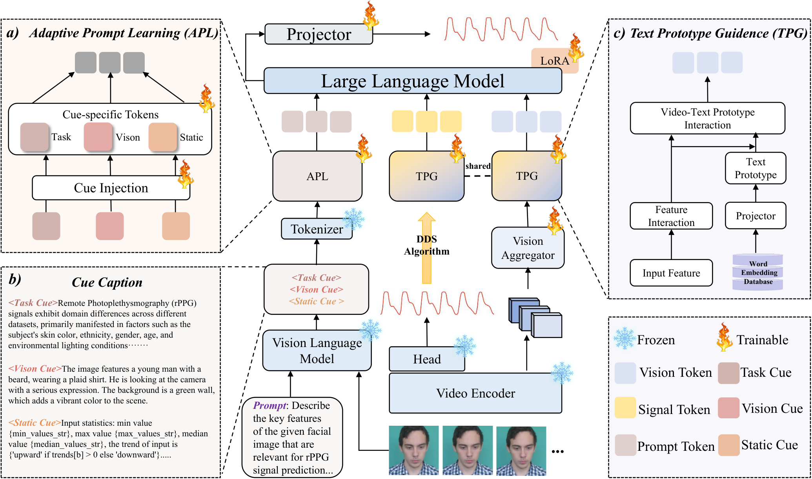

# PhysLLM

[](https://arxiv.org/abs/2505.03621)

Official code for *PhysLLM: Harnessing Large Language Models for Cross-Modal Remote Physiological Sensing*, accepted at **ICLR 2026**.



## Model Overview

This repository contains the cleaned public code path for PhysLLM, including:

- video encoders: `PhysNet`, `PhysFormer`, `EfficientPhys`, `clip`
- face encoder: `FaceXFormer`
- environment encoder: `clip` or a fixed description prompt
- LLM backbones: `BERT`, `GPT2`, `LLAMA`

## Installation

```bash
python -m venv .venv
source .venv/bin/activate
pip install -r requirements.txt
```

If you prefer conda:

```bash
conda env create -f environment.yaml
conda activate physllm
```

## Checkpoint Preparation

Before running, set the required checkpoints:

```bash
export PHYSLLM_VIDEO_ENCODER_CKPT=/path/to/video_encoder_checkpoint.pth
export PHYSLLM_FACE_ENCODER_CKPT=/path/to/facexformer_checkpoint.pt
```

For test-only inference, also set `INFERENCE.MODEL_PATH` in the config file.

## Quick Start

Train:

```bash
CUDA_VISIBLE_DEVICES=0 python main.py \
  --config_file configs/physllm_multisource_train_example.yaml
```

Test:

```bash
CUDA_VISIBLE_DEVICES=0 python main.py \
  --config_file configs/physllm_only_test_zpu_example.yaml
```

## Citation

If you find this repository useful, please cite:

```bibtex
@inproceedings{xie2026physllm,
  title={PhysLLM: Harnessing Large Language Models for Cross-Modal Remote Physiological Sensing},
  author={Xie, Yiping and Zhao, Bo and Dai, Mingtong and Zhou, Jian-Ping and Sun, Yue and Tan, Tao and Xie, Weicheng and Shen, Linlin and Yu, Zitong},
  booktitle={International Conference on Learning Representations},
  year={2026},
  note={Published as a conference paper at ICLR 2026},
  url={https://arxiv.org/abs/2505.03621}
}
```
